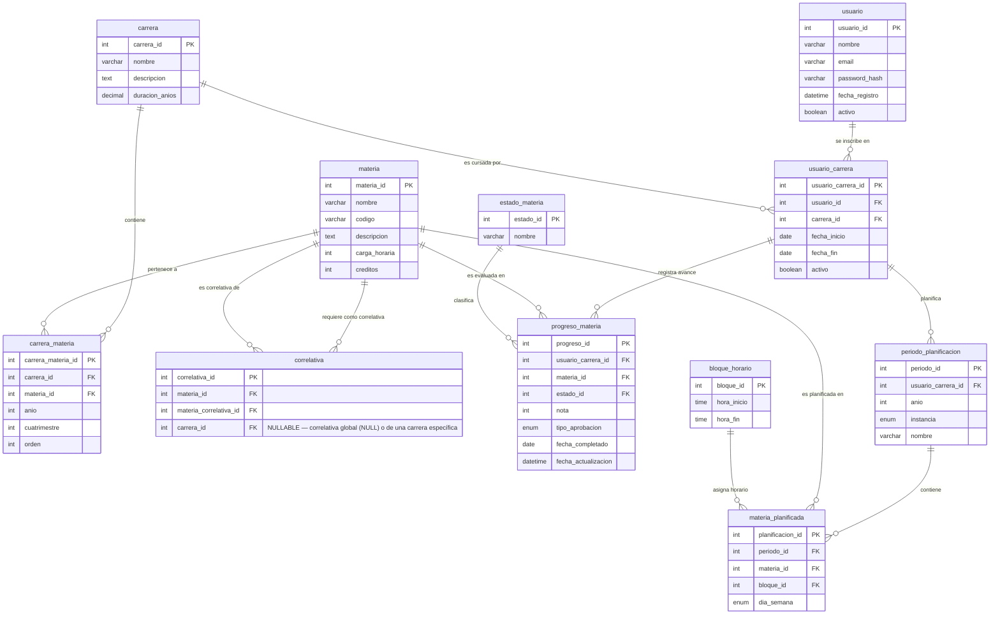

# Diseño de Base de Datos — Sistema de Seguimiento de Carreras Universitarias


> ✅ **Implementado en `backend/`** — Código completo y compilando sin errores.

## Diagrama Entidad-Relación (ERD)



---

## Detalle de Tablas

### 1. `usuario`

Almacena los datos de cada usuario registrado en el sistema.

| Atributo | Tipo | Restricciones | Descripción |
|---|---|---|---|
| `usuario_id` | `INT` | `PK` `AUTO_INCREMENT` | Identificador único del usuario |
| `nombre` | `VARCHAR(150)` | `NOT NULL` | Nombre completo del usuario |
| `email` | `VARCHAR(200)` | `NOT NULL` `UNIQUE` | Correo electrónico, usado para inicio de sesión |
| `password_hash` | `VARCHAR(255)` | `NOT NULL` | Hash de la contraseña (bcrypt / argon2) |
| `fecha_registro` | `DATETIME` | `NOT NULL` `DEFAULT CURRENT_TIMESTAMP` | Momento en que se creó la cuenta |
| `activo` | `BOOLEAN` | `NOT NULL` `DEFAULT TRUE` | Indica si la cuenta está habilitada |

---

### 2. `carrera`

Catálogo de carreras universitarias disponibles en el sistema.

| Atributo | Tipo | Restricciones | Descripción |
|---|---|---|---|
| `carrera_id` | `INT` | `PK` `AUTO_INCREMENT` | Identificador único de la carrera |
| `nombre` | `VARCHAR(200)` | `NOT NULL` | Nombre oficial de la carrera (ej. "Ingeniería en Sistemas") |
| `descripcion` | `TEXT` | — | Descripción o detalle adicional de la carrera |
| `duracion_anios` | `DECIMAL(3,1)` | `NOT NULL` | Duración estimada en años (ej. 3.5 para 3 años y medio) |

---

### 3. `materia`

Catálogo de materias ofrecidas por las distintas carreras.

| Atributo | Tipo | Restricciones | Descripción |
|---|---|---|---|
| `materia_id` | `INT` | `PK` `AUTO_INCREMENT` | Identificador único de la materia |
| `nombre` | `VARCHAR(200)` | `NOT NULL` | Nombre de la materia (ej. "Álgebra Lineal") |
| `codigo` | `VARCHAR(20)` | `NOT NULL` `UNIQUE` | Código alfanumérico institucional (ej. "MAT101") |
| `descripcion` | `TEXT` | — | Contenidos mínimos o descripción |
| `carga_horaria` | `INT` | `NOT NULL` | Cantidad total de horas de la materia |
| `creditos` | `INT` | `NOT NULL` | Cantidad de créditos que otorga la materia |

---

### 4. `usuario_carrera`

Tabla pivote para la relación **Muchos a Muchos** entre `usuario` y `carrera`. Un usuario puede estar cursando una o más carreras simultáneamente.

| Atributo | Tipo | Restricciones | Descripción |
|---|---|---|---|
| `usuario_carrera_id` | `INT` | `PK` `AUTO_INCREMENT` | Identificador único del registro |
| `usuario_id` | `INT` | `FK → usuario.usuario_id` `NOT NULL` | Referencia al usuario |
| `carrera_id` | `INT` | `FK → carrera.carrera_id` `NOT NULL` | Referencia a la carrera |
| `fecha_inicio` | `DATE` | `NOT NULL` | Fecha en que el usuario comenzó la carrera |
| `fecha_fin` | `DATE` | `NULL` | Fecha de egreso (se completa al recibirse) |
| `activo` | `BOOLEAN` | `NOT NULL` `DEFAULT TRUE` | Indica si el vínculo usuario-carrera sigue vigente |

**Índice único:** `(usuario_id, carrera_id)` — evita inscripciones duplicadas.

---

### 5. `carrera_materia` — Plan de Estudios

Tabla pivote para la relación **Muchos a Muchos** entre `carrera` y `materia`. Define el plan de estudios: qué materias pertenecen a cada carrera y en qué orden, año y cuatrimestre sugerido se ubican.

| Atributo | Tipo | Restricciones | Descripción |
|---|---|---|---|
| `carrera_materia_id` | `INT` | `PK` `AUTO_INCREMENT` | Identificador único del registro |
| `carrera_id` | `INT` | `FK → carrera.carrera_id` `NOT NULL` | Referencia a la carrera |
| `materia_id` | `INT` | `FK → materia.materia_id` `NOT NULL` | Referencia a la materia |
| `anio` | `INT` | `NOT NULL` `CHECK (anio > 0)` | Año sugerido en el plan (1, 2, 3…) |
| `cuatrimestre` | `INT` | `NOT NULL` `CHECK (cuatrimestre IN (1,2))` | Cuatrimestre sugerido (1 o 2) |
| `orden` | `INT` | `NOT NULL` | Número de orden de la materia dentro del plan (ej. "Materia 1", "Materia 2") |

**Índice único:** `(carrera_id, materia_id)` — evita que una misma materia se asigne dos veces a la misma carrera.

---

### 6. `correlativa`

Tabla pivote para la relación **Muchos a Muchos** auto-referenciada sobre `materia`. Cada fila indica que una materia (`materia_id`) requiere haber aprobado otra materia (`materia_correlativa_id`) como correlativa previa. Opcionalmente puede asociarse a una carrera específica: si `carrera_id` es `NULL`, la correlativa es global (aplica a todas las carreras); si tiene un valor, solo aplica a esa carrera.

| Atributo | Tipo | Restricciones | Descripción |
|---|---|---|---|
| `correlativa_id` | `INT` | `PK` `AUTO_INCREMENT` | Identificador único del registro |
| `materia_id` | `INT` | `FK → materia.materia_id` `NOT NULL` | Materia que **requiere** la correlativa |
| `materia_correlativa_id` | `INT` | `FK → materia.materia_id` `NOT NULL` | Materia que **es** la correlativa (requisito previo) |
| `carrera_id` | `INT` | `FK → carrera.carrera_id` `NULL` | Carrera específica (opcional). `NULL` = global |

**Índice único:** `(materia_id, materia_correlativa_id, carrera_id)` — evita pares duplicados para la misma carrera (o para global cuando carrera_id es NULL).

---

### 7. `estado_materia`

Catálogo de estados posibles para el progreso de una materia. Tabla de dominio que reemplaza un `ENUM` y permite escalabilidad futura.

| Atributo | Tipo | Restricciones | Descripción |
|---|---|---|---|
| `estado_id` | `INT` | `PK` `AUTO_INCREMENT` | Identificador único del estado |
| `nombre` | `VARCHAR(20)` | `NOT NULL` `UNIQUE` | Nombre del estado: `Pendiente`, `En Proceso`, `Completada` |

**Valores predefinidos:**

| estado_id | nombre |
|---|---|
| 1 | Pendiente |
| 2 | En Proceso |
| 3 | Completada |

---

### 8. `progreso_materia`

Registro del avance académico de un usuario en una materia específica dentro de una carrera determinada.

| Atributo | Tipo | Restricciones | Descripción |
|---|---|---|---|
| `progreso_id` | `INT` | `PK` `AUTO_INCREMENT` | Identificador único del registro |
| `usuario_carrera_id` | `INT` | `FK → usuario_carrera.usuario_carrera_id` `NOT NULL` | Vinculación del usuario con la carrera |
| `materia_id` | `INT` | `FK → materia.materia_id` `NOT NULL` | Materia evaluada |
| `estado_id` | `INT` | `FK → estado_materia.estado_id` `NOT NULL` `DEFAULT 1` | Estado actual: Pendiente (1), En Proceso (2) o Completada (3) |
| `nota` | `INT` | `CHECK (nota >= 4 AND nota <= 10)` `NULL` | Calificación numérica entera (4-10). **Obligatoria** solo cuando `estado_id = 3` (Completada) |
| `tipo_aprobacion` | `ENUM('Final','Promocion')` | `NULL` | Tipo de aprobación: `Final` (examen final) o `Promocion` (promoción directa). Obligatorio cuando `estado_id = 3` |
| `fecha_completado` | `DATE` | `NULL` | Fecha en que se completó la materia (solo si `estado_id = 3`) |
| `fecha_actualizacion` | `DATETIME` | `NOT NULL` `DEFAULT CURRENT_TIMESTAMP ON UPDATE CURRENT_TIMESTAMP` | Última modificación del registro |

**Índice único:** `(usuario_carrera_id, materia_id)` — un usuario dentro de una carrera tiene un único progreso por materia.

**Nota:** La obligatoriedad de `nota` y `tipo_aprobacion` cuando `estado_id = 3` debe enforcederse a nivel de aplicación o mediante `CHECK` condicional; si el motor lo soporta, se puede añadir `CHECK (estado_id <> 3 OR (nota IS NOT NULL AND tipo_aprobacion IS NOT NULL))`.

---

### 9. `periodo_planificacion`

Representa un período académico planificado por un usuario dentro de una carrera (verano, 1.er cuatrimestre o 2.º cuatrimestre de un año determinado). Un mismo usuario puede tener múltiples planificaciones para el mismo año e instancia (ej. dos variantes de horario para el mismo cuatrimestre).

| Atributo | Tipo | Restricciones | Descripción |
|---|---|---|---|
| `periodo_id` | `INT` | `PK` `AUTO_INCREMENT` | Identificador único del período |
| `usuario_carrera_id` | `INT` | `FK → usuario_carrera.usuario_carrera_id` `NOT NULL` | Usuario y carrera a la que pertenece la planificación |
| `anio` | `INT` | `NOT NULL` | Año académico (ej. 2026) |
| `instancia` | `ENUM('Verano','1er Cuatrimestre','2do Cuatrimestre')` | `NOT NULL` | Instancia temporal del período |
| `nombre` | `VARCHAR(100)` | `NULL` | Nombre opcional para distinguir múltiples planificaciones (ej. "Variante A", "Plan con inglés") |

---

### 10. `bloque_horario`

Catálogo de bloques fijos de 2 horas, desde las 08:00 hasta las 22:00. Evita la redundancia de almacenar hora_inicio / hora_fin en cada materia planificada.

| Atributo | Tipo | Restricciones | Descripción |
|---|---|---|---|
| `bloque_id` | `INT` | `PK` `AUTO_INCREMENT` | Identificador único del bloque |
| `hora_inicio` | `TIME` | `NOT NULL` | Hora de inicio del bloque (ej. `08:00:00`) |
| `hora_fin` | `TIME` | `NOT NULL` | Hora de fin del bloque (ej. `10:00:00`) |

**Índice único:** `(hora_inicio, hora_fin)` — evita bloques duplicados.

**Bloques predefinidos:**

| bloque_id | hora_inicio | hora_fin |
|---|---|---|
| 1 | 08:00 | 10:00 |
| 2 | 10:00 | 12:00 |
| 3 | 12:00 | 14:00 |
| 4 | 14:00 | 16:00 |
| 5 | 16:00 | 18:00 |
| 6 | 18:00 | 20:00 |
| 7 | 20:00 | 22:00 |

---

### 11. `materia_planificada`

Asigna una materia a un bloque horario y día específico dentro de un período de planificación.

| Atributo | Tipo | Restricciones | Descripción |
|---|---|---|---|
| `planificacion_id` | `INT` | `PK` `AUTO_INCREMENT` | Identificador único del registro |
| `periodo_id` | `INT` | `FK → periodo_planificacion.periodo_id` `NOT NULL` | Período al que pertenece esta planificación |
| `materia_id` | `INT` | `FK → materia.materia_id` `NOT NULL` | Materia que se planifica |
| `bloque_id` | `INT` | `FK → bloque_horario.bloque_id` `NOT NULL` | Bloque horario asignado |
| `dia_semana` | `ENUM('Lunes','Martes','Miércoles','Jueves','Viernes','Sábado')` | `NOT NULL` | Día de la semana en que se cursa la materia |

**Índice único:** `(periodo_id, bloque_id, dia_semana)` — no pueden solaparse dos materias en el mismo bloque horario, mismo día y mismo período.

---

## Consultas para el Módulo de Estadísticas

### Promedio general de la carrera (materias completadas)

```sql
SELECT
    uc.usuario_carrera_id,
    AVG(pm.nota) AS promedio_general
FROM usuario_carrera uc
JOIN progreso_materia pm ON pm.usuario_carrera_id = uc.usuario_carrera_id
JOIN estado_materia em ON em.estado_id = pm.estado_id
WHERE em.nombre = 'Completada'
  AND pm.nota IS NOT NULL
GROUP BY uc.usuario_carrera_id;
```

### Tiempo estimado para recibirse (cuatrimestres restantes)

```sql
SELECT
    uc.usuario_carrera_id,
    COUNT(DISTINCT cm.carrera_materia_id) AS materias_totales,
    COUNT(DISTINCT CASE WHEN em.nombre = 'Completada' THEN cm.carrera_materia_id END) AS materias_completadas,
    COUNT(DISTINCT CASE WHEN em.nombre IS NULL OR em.nombre != 'Completada' THEN cm.carrera_materia_id END) AS materias_pendientes,
    CEIL(
        COUNT(DISTINCT CASE WHEN em.nombre IS NULL OR em.nombre != 'Completada' THEN cm.carrera_materia_id END)
        /
        NULLIF( -- máximo de materias por cuatrimestre según el plan
            (SELECT MAX(materias_por_cuatrimestre)
             FROM (
                 SELECT COUNT(*) AS materias_por_cuatrimestre
                 FROM carrera_materia cm2
                 WHERE cm2.carrera_id = uc.carrera_id
                 GROUP BY cm2.anio, cm2.cuatrimestre
             ) sub
            ), 0
        )
    ) AS cuatrimestres_restantes
FROM usuario_carrera uc
JOIN carrera_materia cm ON cm.carrera_id = uc.carrera_id
LEFT JOIN progreso_materia pm
    ON pm.usuario_carrera_id = uc.usuario_carrera_id
    AND pm.materia_id = cm.materia_id
LEFT JOIN estado_materia em ON em.estado_id = pm.estado_id
WHERE uc.activo = TRUE
GROUP BY uc.usuario_carrera_id, uc.carrera_id;
```

---

## Resumen de Convenciones

- **Claves primarias (PK):** `INT` con `AUTO_INCREMENT` y nombre `{tabla}_id`.
- **Claves foráneas (FK):** `INT NOT NULL` con nombre explícito y `REFERENCES` a la PK correspondiente.
- **Relaciones Muchos a Muchos:** Resueltas con tablas pivote (`usuario_carrera`, `carrera_materia`, `correlativa`).
- **Catálogos fijos:** `estado_materia` se modela como tabla en lugar de `ENUM` para flexibilidad.
- **ENUM:** Se usa solo en atributos con valores pequeños y estables (`instancia`, `dia_semana`).
- **Índices únicos compuestos:** Toda tabla pivote incluye un `UNIQUE` sobre sus FK para evitar duplicados.
