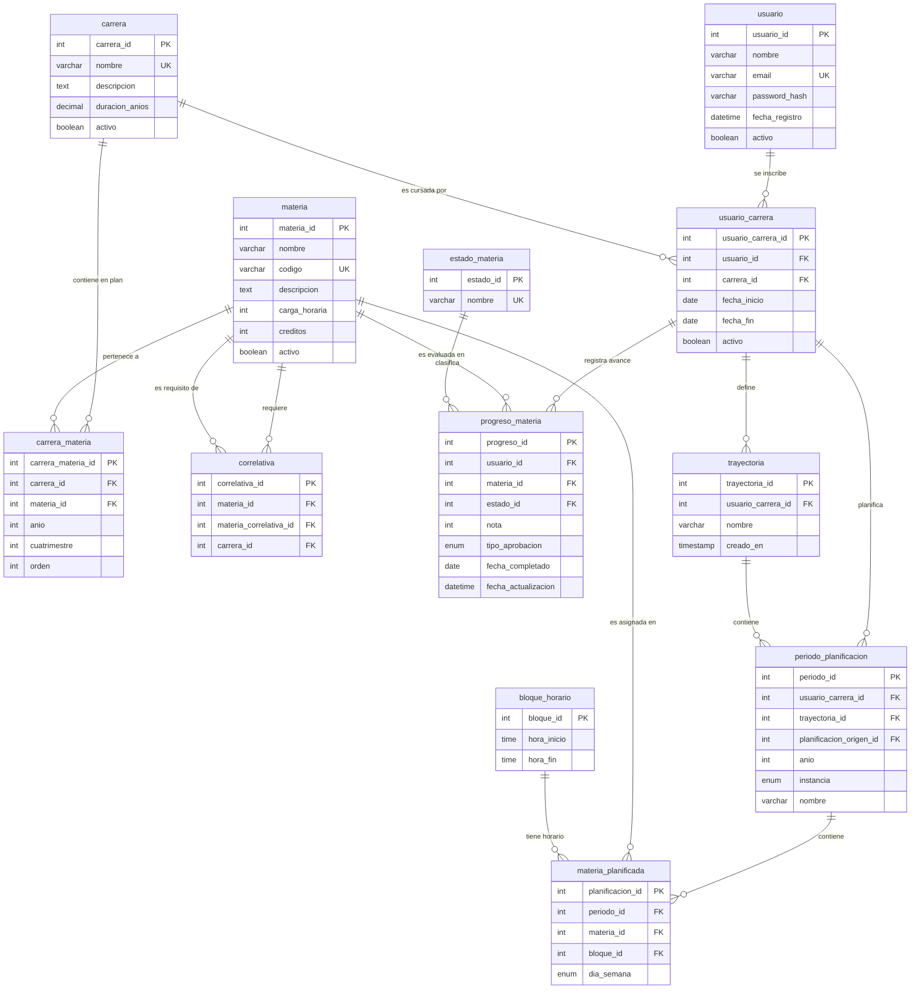

# Diseño de Base de Datos — Sistema de Seguimiento de Carreras Universitarias

> ✅ **Implementado en `backend/`** — 12 entidades TypeORM, migraciones sincronizadas con la base de datos.

> 📌 **Sistema de créditos por actividades:** agrega 7 tablas adicionales (`sistema_creditos`, `categoria_credito`, `actividad_credito`, `carrera_categoria_credito`, `carrera_actividad_credito`, `carrera_actividad_requisito_materia`, `progreso_actividad`). Ver §13 y `docs/implementaciones/sistema-de-creditos.md`.

## Diagrama Entidad-Relación (ERD)


```mermaid
erDiagram
    usuario ||--o{ usuario_carrera : "se inscribe"
    carrera ||--o{ usuario_carrera : "es cursada por"
    carrera ||--o{ carrera_materia : "contiene en plan"
    materia ||--o{ carrera_materia : "pertenece a"
    materia ||--o{ correlativa : "requiere"
    materia ||--o{ correlativa : "es requisito de"
    usuario_carrera ||--o{ progreso_materia : "registra avance"
    materia ||--o{ progreso_materia : "es evaluada en"
    estado_materia ||--o{ progreso_materia : "clasifica"
    usuario_carrera ||--o{ periodo_planificacion : "planifica"
    usuario_carrera ||--o{ trayectoria : "define"
    trayectoria ||--o{ periodo_planificacion : "contiene"
    periodo_planificacion ||--o{ materia_planificada : "contiene"
    materia ||--o{ materia_planificada : "es asignada en"
    bloque_horario ||--o{ materia_planificada : "tiene horario"

    usuario {
        int usuario_id PK
        varchar nombre
        varchar email UK
        varchar password_hash
        datetime fecha_registro
        boolean activo
    }

    carrera {
        int carrera_id PK
        varchar nombre UK
        text descripcion
        decimal duracion_anios
        boolean activo
    }

    materia {
        int materia_id PK
        varchar nombre
        varchar codigo UK
        text descripcion
        int carga_horaria
        int creditos
        boolean activo
    }

    usuario_carrera {
        int usuario_carrera_id PK
        int usuario_id FK
        int carrera_id FK
        date fecha_inicio
        date fecha_fin
        boolean activo
    }

    carrera_materia {
        int carrera_materia_id PK
        int carrera_id FK
        int materia_id FK
        int anio
        int cuatrimestre
        int orden
    }

    correlativa {
        int correlativa_id PK
        int materia_id FK
        int materia_correlativa_id FK
        int carrera_id FK
    }

    estado_materia {
        int estado_id PK
        varchar nombre UK
    }

    progreso_materia {
        int progreso_id PK
        int usuario_id FK
        int materia_id FK
        int estado_id FK
        int nota
        enum tipo_aprobacion
        date fecha_completado
        datetime fecha_actualizacion
    }

    periodo_planificacion {
        int periodo_id PK
        int usuario_carrera_id FK
        int trayectoria_id FK
        int planificacion_origen_id FK
        int anio
        enum instancia
        varchar nombre
    }

    trayectoria {
        int trayectoria_id PK
        int usuario_carrera_id FK
        varchar nombre
        timestamp creado_en
    }

    bloque_horario {
        int bloque_id PK
        time hora_inicio
        time hora_fin
    }

    materia_planificada {
        int planificacion_id PK
        int periodo_id FK
        int materia_id FK
        int bloque_id FK
        enum dia_semana
    }
```

---

## Detalle de Tablas

### 1. `usuario`

| Atributo | Tipo | Restricciones | Descripción |
|---|---|---|---|
| `usuario_id` | `INT` | `PK AUTO_INCREMENT` | Identificador único |
| `nombre` | `VARCHAR(150)` | `NOT NULL` | Nombre completo |
| `email` | `VARCHAR(200)` | `NOT NULL UNIQUE` | Email de inicio de sesión |
| `password_hash` | `VARCHAR(255)` | `NOT NULL` | Hash bcrypt/argon2 |
| `fecha_registro` | `DATETIME` | `NOT NULL DEFAULT CURRENT_TIMESTAMP` | Fecha de alta |
| `activo` | `BOOLEAN` | `NOT NULL DEFAULT TRUE` | Cuenta habilitada |

---

### 2. `carrera`

| Atributo | Tipo | Restricciones | Descripción |
|---|---|---|---|
| `carrera_id` | `INT` | `PK AUTO_INCREMENT` | Identificador único |
| `nombre` | `VARCHAR(200)` | `NOT NULL UNIQUE` | Nombre oficial |
| `descripcion` | `TEXT` | `NULL` | Descripción |
| `duracion_anios` | `DECIMAL(3,1)` | `NOT NULL` | Duración en años (ej. 3.5) |
| `activo` | `BOOLEAN` | `NOT NULL DEFAULT TRUE` | Soft delete |

---

### 3. `materia`

| Atributo | Tipo | Restricciones | Descripción |
|---|---|---|---|
| `materia_id` | `INT` | `PK AUTO_INCREMENT` | Identificador único |
| `nombre` | `VARCHAR(200)` | `NOT NULL` | Nombre de la materia |
| `codigo` | `VARCHAR(20)` | `NOT NULL UNIQUE` | Código alfanumérico (ej. "MAT101") |
| `descripcion` | `TEXT` | `NULL` | Contenidos mínimos |
| `carga_horaria` | `INT` | `NOT NULL` | Horas totales |
| `creditos` | `INT` | `NOT NULL` | Créditos que otorga |
| `activo` | `BOOLEAN` | `NOT NULL DEFAULT TRUE` | Soft delete |

---

### 4. `usuario_carrera`

Tabla pivote M:N entre `usuario` y `carrera`.

| Atributo | Tipo | Restricciones | Descripción |
|---|---|---|---|
| `usuario_carrera_id` | `INT` | `PK AUTO_INCREMENT` | Identificador único |
| `usuario_id` | `INT` | `FK NOT NULL ON DELETE CASCADE` | Referencia al usuario |
| `carrera_id` | `INT` | `FK NOT NULL ON DELETE CASCADE` | Referencia a la carrera |
| `fecha_inicio` | `DATE` | `NOT NULL` | Fecha de inicio |
| `fecha_fin` | `DATE` | `NULL` | Fecha de egreso |
| `activo` | `BOOLEAN` | `NOT NULL DEFAULT TRUE` | Vigencia del vínculo |

**Índices únicos:**
- `(usuario_id, carrera_id)` — evita inscripciones duplicadas.

---

### 5. `carrera_materia` — Plan de Estudios

Tabla pivote M:N entre `carrera` y `materia`. Define qué materias pertenecen a cada carrera con su ubicación en el plan.

| Atributo | Tipo | Restricciones | Descripción |
|---|---|---|---|
| `carrera_materia_id` | `INT` | `PK AUTO_INCREMENT` | Identificador único |
| `carrera_id` | `INT` | `FK NOT NULL ON DELETE CASCADE` | Referencia a la carrera |
| `materia_id` | `INT` | `FK NOT NULL ON DELETE CASCADE` | Referencia a la materia |
| `anio` | `INT` | `NOT NULL CHECK (> 0)` | Año sugerido (1, 2, 3…) |
| `cuatrimestre` | `INT` | `NOT NULL CHECK (IN (1,2))` | Cuatrimestre sugerido |
| `orden` | `INT` | `NOT NULL` | Número de orden |

**Índices únicos:**
- `(carrera_id, materia_id)` — evita materias duplicadas en la misma carrera.
- `(carrera_id, orden)` — evita órdenes duplicados en la misma carrera.

---

### 6. `correlativa`

Tabla pivote M:N auto-referenciada sobre `materia`. Indica que una materia (`materia_id`) requiere haber aprobado otra (`materia_correlativa_id`), dentro de una carrera específica.

| Atributo | Tipo | Restricciones | Descripción |
|---|---|---|---|
| `correlativa_id` | `INT` | `PK AUTO_INCREMENT` | Identificador único |
| `materia_id` | `INT` | `FK NOT NULL ON DELETE CASCADE` | Materia que **requiere** la correlativa |
| `materia_correlativa_id` | `INT` | `FK NOT NULL ON DELETE CASCADE` | Materia **requisito** |
| `carrera_id` | `INT` | `FK NOT NULL ON DELETE CASCADE` | Carrera a la que aplica |

**Índices:**
- `IDX_correlativa_materia_id` sobre `materia_id`.
- `IDX_correlativa_materia_correlativa_id` sobre `materia_correlativa_id`.
- **Único:** `(materia_id, materia_correlativa_id, carrera_id)`.

---

### 7. `estado_materia`

Catálogo de estados del progreso (reemplaza un `ENUM`).

| Atributo | Tipo | Restricciones | Descripción |
|---|---|---|---|
| `estado_id` | `INT` | `PK AUTO_INCREMENT` | Identificador |
| `nombre` | `VARCHAR(20)` | `NOT NULL UNIQUE` | `Pendiente`, `En Proceso`, `Completada` |

| estado_id | nombre |
|---|---|
| 1 | Pendiente |
| 2 | En Proceso |
| 3 | Completada |

---

### 8. `progreso_materia`

Registro del avance de un usuario sobre una materia. El progreso es **compartido entre carreras**: si la misma materia existe en dos carreras distintas, el estado/nota es único por usuario (no por inscripción).

| Atributo | Tipo | Restricciones | Descripción |
|---|---|---|---|
| `progreso_id` | `INT` | `PK AUTO_INCREMENT` | Identificador único |
| `usuario_id` | `INT` | `FK NOT NULL ON DELETE CASCADE` | Usuario dueño del progreso (compartido entre sus carreras) |
| `materia_id` | `INT` | `FK NOT NULL ON DELETE CASCADE` | Materia evaluada |
| `estado_id` | `INT` | `FK NOT NULL DEFAULT 1` | Pendiente/En Proceso/Completada |
| `nota` | `INT` | `CHECK (4–10) NULL` | Nota (obligatoria si estado = Completada) |
| `tipo_aprobacion` | `ENUM('Final','Promocion')` | `NULL` | Tipo de aprobación (obligatorio si estado = Completada) |
| `fecha_completado` | `DATE` | `NULL` | Fecha de completado |
| `fecha_actualizacion` | `DATETIME` | `NOT NULL DEFAULT CURRENT_TIMESTAMP ON UPDATE` | Última modificación |

**Índice único:** `(usuario_id, materia_id)` — un progreso por materia por usuario (independiente de la carrera).

---

### 9. `periodo_planificacion`

Período académico planificado (Verano, 1.er Cuatrimestre, 2.º Cuatrimestre). Un usuario puede tener múltiples planificaciones para un mismo año/instancia (variantes). Opcionalmente asociado a una `trayectoria` y un `planificacion_origen` para forks.

| Atributo | Tipo | Restricciones | Descripción |
|---|---|---|---|
| `periodo_id` | `INT` | `PK AUTO_INCREMENT` | Identificador único |
| `usuario_carrera_id` | `INT` | `FK NOT NULL ON DELETE CASCADE` | Usuario + carrera |
| `trayectoria_id` | `INT` | `FK NULL ON DELETE SET NULL` | Trayectoria asociada |
| `planificacion_origen_id` | `INT` | `FK NULL ON DELETE CASCADE` | Período origen del fork |
| `anio` | `INT` | `NOT NULL` | Año académico |
| `instancia` | `ENUM('Verano','1er Cuatrimestre','2do Cuatrimestre')` | `NOT NULL` | Instancia temporal |
| `nombre` | `VARCHAR(100)` | `NOT NULL` | Nombre para distinguir variantes (ej. "Variante A") |

---

### 10. `trayectoria`

Define una trayectoria académica (secuencia de planificaciones). Un `usuario_carrera` puede tener múltiples trayectorias (bifurcaciones).

| Atributo | Tipo | Restricciones | Descripción |
|---|---|---|---|
| `trayectoria_id` | `INT` | `PK AUTO_INCREMENT` | Identificador único |
| `usuario_carrera_id` | `INT` | `FK NOT NULL ON DELETE CASCADE` | Usuario + carrera |
| `nombre` | `VARCHAR(150)` | `NOT NULL` | Nombre de la trayectoria |
| `creado_en` | `TIMESTAMP` | `NOT NULL DEFAULT CURRENT_TIMESTAMP` | Fecha de creación |

---

### 11. `bloque_horario`

Catálogo de 7 bloques fijos de 2h (08:00–22:00).

| Atributo | Tipo | Restricciones | Descripción |
|---|---|---|---|
| `bloque_id` | `INT` | `PK AUTO_INCREMENT` | Identificador único |
| `hora_inicio` | `TIME` | `NOT NULL` | Ej. `08:00:00` |
| `hora_fin` | `TIME` | `NOT NULL` | Ej. `10:00:00` |

| bloque_id | hora_inicio | hora_fin |
|---|---|---|
| 1 | 08:00 | 10:00 |
| 2 | 10:00 | 12:00 |
| 3 | 12:00 | 14:00 |
| 4 | 14:00 | 16:00 |
| 5 | 16:00 | 18:00 |
| 6 | 18:00 | 20:00 |
| 7 | 20:00 | 22:00 |

---

### 12. `materia_planificada`

Asigna una materia a un bloque horario y día dentro de un período.

| Atributo | Tipo | Restricciones | Descripción |
|---|---|---|---|
| `planificacion_id` | `INT` | `PK AUTO_INCREMENT` | Identificador único |
| `periodo_id` | `INT` | `FK NOT NULL ON DELETE CASCADE` | Período de planificación |
| `materia_id` | `INT` | `FK NOT NULL ON DELETE CASCADE` | Materia planificada |
| `bloque_id` | `INT` | `FK NOT NULL` | Bloque horario |
| `dia_semana` | `ENUM('Lunes','Martes','Miércoles','Jueves','Viernes','Sábado')` | `NOT NULL` | Día de cursada |

**Índice único:** `(periodo_id, bloque_id, dia_semana)` — no solapar materias en el mismo bloque/día/período.

---

### 13. Tablas del sistema de créditos por actividades

El **sistema de créditos por actividades** (seminarios, proyectos, idiomas, etc.) agrega 7 tablas que viven en `backend/src/modules/creditos/entities/` y se documentan en detalle en `docs/implementaciones/sistema-de-creditos.md` §2:

- `sistema_creditos` — config 1:1 con `carrera` (`total_creditos`, CHECK > 0).
- `categoria_credito` — catálogo global de categorías (`nombre` UNIQUE, `activo` soft delete).
- `actividad_credito` — catálogo global de actividades (`nombre` + `categoria_credito_id` UNIQUE compuesto, `creditos` CHECK > 0). **Sin** relación de requisitos (los requisitos son por carrera).
- `carrera_categoria_credito` — pivote M:N carrera↔categoría con `minimo_creditos` (UNIQUE `(carrera_id, categoria_credito_id)`).
- `carrera_actividad_credito` — pivote M:N carrera↔actividad (UNIQUE `(carrera_id, actividad_credito_id)`); es el ancla de los requisitos por carrera.
- `carrera_actividad_requisito_materia` — pivote requisito: actividad **de una carrera** ↔ materia (UNIQUE `(carrera_actividad_credito_id, materia_id)`).
- `progreso_actividad` — progreso por `usuario_id` + `actividad_credito_id` (compartido entre carreras, UNIQUE `(usuario_id, actividad_credito_id)`).

> Se crean automáticamente con `synchronize: true` al arrancar el backend (no usan migrations).

---

## Consultas para el Módulo de Estadísticas

### Promedio general de la carrera (materias completadas)

```sql
SELECT
    uc.usuario_id,
    AVG(pm.nota) AS promedio_general
FROM usuario_carrera uc
JOIN progreso_materia pm ON pm.usuario_id = uc.usuario_id
JOIN estado_materia em ON em.estado_id = pm.estado_id
WHERE em.nombre = 'Completada'
  AND pm.nota IS NOT NULL
GROUP BY uc.usuario_id;
```

### Tiempo estimado para recibirse (cuatrimestres restantes)

```sql
SELECT
    uc.usuario_id,
    COUNT(DISTINCT cm.carrera_materia_id) AS materias_totales,
    COUNT(DISTINCT CASE WHEN em.nombre = 'Completada' THEN cm.carrera_materia_id END) AS materias_completadas,
    COUNT(DISTINCT CASE WHEN em.nombre IS NULL OR em.nombre != 'Completada' THEN cm.carrera_materia_id END) AS materias_pendientes,
    CEIL(
        COUNT(DISTINCT CASE WHEN em.nombre IS NULL OR em.nombre != 'Completada' THEN cm.carrera_materia_id END)
        /
        NULLIF(
            (SELECT MAX(materias_por_cuatrimestre)
             FROM (
                 SELECT COUNT(*) AS materias_por_cuatrimestre
                 FROM carrera_materia cm2
                 WHERE cm2.carrera_id = uc.carrera_id
                 GROUP BY cm2.anio, cm2.cuatrimestre
             ) sub
            ), 0
        )
    ) AS cuatrimestres_restantes
FROM usuario_carrera uc
JOIN carrera_materia cm ON cm.carrera_id = uc.carrera_id
LEFT JOIN progreso_materia pm
    ON pm.usuario_id = uc.usuario_id
    AND pm.materia_id = cm.materia_id
LEFT JOIN estado_materia em ON em.estado_id = pm.estado_id
WHERE uc.activo = TRUE
GROUP BY uc.usuario_id, uc.carrera_id;
```

---

## Resumen de Convenciones

- **PK:** `INT AUTO_INCREMENT` con nombre `{tabla}_id`.
- **FK:** `INT NOT NULL` con nombre explícito y `REFERENCES` a la PK correspondiente.
- **M:N:** Tablas pivote (`usuario_carrera`, `carrera_materia`, `correlativa`, y las de créditos `carrera_categoria_credito`, `carrera_actividad_credito`, `carrera_actividad_requisito_materia`).
- **Catálogos:** `estado_materia` como tabla (no `ENUM`).
- **ENUM:** Solo para valores pequeños y estables (`instancia`, `dia_semana`, `tipo_aprobacion`).
- **Índices únicos compuestos:** Toda tabla pivote incluye un `UNIQUE` sobre sus FK.
- **Soft delete:** `activo` booleano en `usuario`, `carrera`, `materia`, `usuario_carrera`.
