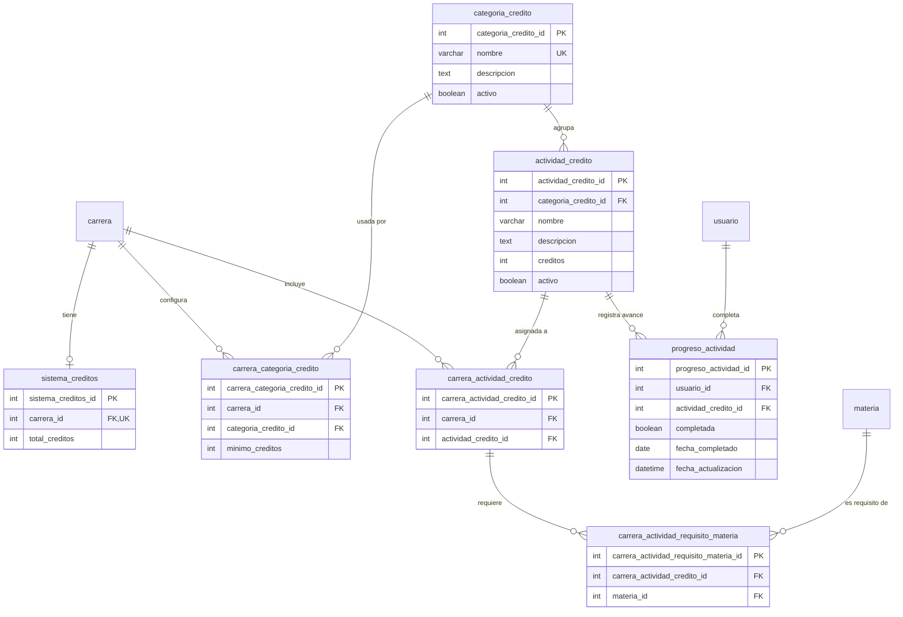

# Sistema de créditos por actividades en carreras

## Problema

Hoy el único concepto de "créditos" es el campo `creditos` de la tabla `materia` (créditos curriculares que aporta cada materia al aprobarla, reflejados en la `CreditosCard` del dashboard). No existe un modelo de **créditos por actividades** (seminarios, proyectos, extensión, idiomas, etc.) que algunas carreras exigen para recibirse.

## Requerimientos

1. Una carrera puede tener o no un sistema de créditos.
2. Si lo tiene, pide una **cantidad total** de créditos para recibirse.
3. El sistema se organiza en **categorías**. Cada categoría tiene un **mínimo requerido** y actividades asociadas que aportan créditos al completarse. Ej.: la carrera pide 10 créditos con categorías A y B; exige un mínimo de 3 por categoría y el resto (4) se puede completar en la categoría que el alumno elija.
4. Categorías y actividades **se comparten entre múltiples carreras** (progreso único por usuario, como `progreso_materia`), pero puede haber actividades que pertenezcan a una única carrera.
5. **Algunas** actividades pueden **requerir haber aprobado determinadas materias** (correlativas). Es **opcional**: una actividad sin requisitos se puede completar directamente. Las que sí tienen, solo se completan si el usuario tiene aprobadas sus materias requisito. Los requisitos son **por carrera** (no globales): la misma actividad puede exigir materias distintas en cada carrera. En el catálogo global (`actividad_credito`) las actividades **no** llevan requisitos; estos viven en el pivote por carrera `carrera_actividad_requisito_materia`.
6. Agregar: una página de seguimiento de créditos, una pestaña en la edición de carrera para configurar el sistema (categorías y actividades, existentes o nuevas), mostrar el sistema en el detalle de la carrera, y un gráfico de progreso de créditos en el dashboard.

---

## 1. Modelo de datos

> El backend usa `synchronize: true` (`backend/src/config/database.config.ts`) y **no usa migrations**. Al crear las entidades y arrancar el backend, TypeORM crea las tablas automáticamente. No hace falta script de migración; si hay datos previos que conservar, hacer backup antes de levantar por primera vez.

### ERD (tablas nuevas)



### Convenciones aplicadas

- PK `{tabla}_id` INT AUTO_INCREMENT.
- FK con nombre explícito, NOT NULL e índice.
- Tablas pivote para M:N (`carrera_categoria_credito`, `carrera_actividad_credito`, `carrera_actividad_requisito_materia`).
- Soft delete `activo` en los catálogos (`categoria_credito`, `actividad_credito`).
- Progreso compartido por `usuario_id` (igual que `progreso_materia` tras el refactor de progreso compartido).

---

## 2. Tablas en detalle

### `sistema_creditos` — config 1:1 con `carrera`

| Atributo | Tipo | Restricciones | Descripción |
|---|---|---|---|
| `sistema_creditos_id` | INT | PK AUTO_INCREMENT | Identificador |
| `carrera_id` | INT | FK NOT NULL UNIQUE, ON DELETE CASCADE | Carrera dueña del sistema |
| `total_creditos` | INT | NOT NULL CHECK (> 0) | Créditos totales para recibirse |

> La ausencia de fila en esta tabla = la carrera **no** tiene sistema de créditos.

### `categoria_credito` — catálogo global de categorías

| Atributo | Tipo | Restricciones | Descripción |
|---|---|---|---|
| `categoria_credito_id` | INT | PK AUTO_INCREMENT | Identificador |
| `nombre` | VARCHAR(200) | NOT NULL UNIQUE | Ej. "Seminarios", "Proyectos" |
| `descripcion` | TEXT | NULL | Descripción opcional |
| `activo` | BOOLEAN | NOT NULL DEFAULT TRUE | Soft delete |

### `actividad_credito` — catálogo global de actividades

| Atributo | Tipo | Restricciones | Descripción |
|---|---|---|---|
| `actividad_credito_id` | INT | PK AUTO_INCREMENT | Identificador |
| `categoria_credito_id` | INT | FK NOT NULL ON DELETE CASCADE | Categoría a la que pertenece |
| `nombre` | VARCHAR(200) | NOT NULL | Ej. "Taller de liderazgo" |
| `descripcion` | TEXT | NULL | Descripción opcional |
| `creditos` | INT | NOT NULL CHECK (> 0) | Créditos que aporta al completarse |
| `activo` | BOOLEAN | NOT NULL DEFAULT TRUE | Soft delete |

**Índice único:** `(nombre, categoria_credito_id)` — evita actividades duplicadas dentro de la misma categoría. **No** tiene relación de requisitos: las actividades del catálogo global no conocen materias.

### `carrera_actividad_requisito_materia` — materias requisito (correlativas) por carrera

| Atributo | Tipo | Restricciones | Descripción |
|---|---|---|---|
| `carrera_actividad_requisito_materia_id` | INT | PK AUTO_INCREMENT | Identificador |
| `carrera_actividad_credito_id` | INT | FK NOT NULL ON DELETE CASCADE | Actividad **de esa carrera** que **requiere** la materia |
| `materia_id` | INT | FK NOT NULL ON DELETE CASCADE | Materia **requisito** (debe estar aprobada) |

**Índice único:** `(carrera_actividad_credito_id, materia_id)`.

> El requisito es **por carrera**: cuelga del pivote `carrera_actividad_credito` (no de `actividad_credito`). La misma actividad puede exigir materias distintas en cada carrera o ninguna. Como `progreso_materia` es compartido por usuario, una materia aprobada en cualquier carrera del usuario cumple el requisito.

### `carrera_categoria_credito` — categorías del sistema de una carrera (pivote M:N)

| Atributo | Tipo | Restricciones | Descripción |
|---|---|---|---|
| `carrera_categoria_credito_id` | INT | PK AUTO_INCREMENT | Identificador |
| `carrera_id` | INT | FK NOT NULL ON DELETE CASCADE | Carrera |
| `categoria_credito_id` | INT | FK NOT NULL ON DELETE CASCADE | Categoría incluida |
| `minimo_creditos` | INT | NOT NULL CHECK (>= 0) | Mínimo exigido en esa categoría |

**Índice único:** `(carrera_id, categoria_credito_id)`.

### `carrera_actividad_credito` — actividades incluidas en el sistema de una carrera (pivote M:N)

| Atributo | Tipo | Restricciones | Descripción |
|---|---|---|---|
| `carrera_actividad_credito_id` | INT | PK AUTO_INCREMENT | Identificador |
| `carrera_id` | INT | FK NOT NULL ON DELETE CASCADE | Carrera |
| `actividad_credito_id` | INT | FK NOT NULL ON DELETE CASCADE | Actividad incluida |

**Índice único:** `(carrera_id, actividad_credito_id)`.

> Este pivote es el que define si una actividad es **compartida** (figura en varias carreras) o **exclusiva** (figura en una sola). La actividad en sí vive en el catálogo global; su categoría es fija. Además es el ancla de los **requisitos por carrera**: tiene un `@OneToMany` a `CarreraActividadRequisitoMateria` (`materiasRequeridas`), cargado con `materia` en las consultas de configuración/progreso.

### `progreso_actividad` — avance del usuario sobre una actividad

| Atributo | Tipo | Restricciones | Descripción |
|---|---|---|---|
| `progreso_actividad_id` | INT | PK AUTO_INCREMENT | Identificador |
| `usuario_id` | INT | FK NOT NULL ON DELETE CASCADE | Usuario (progreso compartido entre carreras) |
| `actividad_credito_id` | INT | FK NOT NULL ON DELETE CASCADE | Actividad evaluada |
| `completada` | BOOLEAN | NOT NULL DEFAULT FALSE | Actividad completada |
| `fecha_completado` | DATE | NULL | Fecha de completado |
| `fecha_actualizacion` | DATETIME | NOT NULL DEFAULT CURRENT_TIMESTAMP ON UPDATE | Última modificación |

**Índice único:** `(usuario_id, actividad_credito_id)` — una actividad se completa una vez, compartida entre todas las carreras que la incluyan.

---

## 3. Reglas de negocio del cálculo

Dada una carrera `C` con `sistema_creditos.total_creditos = T`, categorías `(cat, minimo)` y actividades `A_C`:

- **Créditos obtenidos en una categoría** = suma de `creditos` de las actividades de `A_C` de esa categoría que el usuario completó.
- **Créditos obtenidos totales** = suma de `creditos` de todas las actividades de `A_C` completadas (el excedente de una categoría cuenta para el total, no hay tope por categoría).
- **Sistema completo** ⟺ `obtenidos_total >= T` **y** para cada categoría `obtenidos[cat] >= minimo[cat]`.
- **Actividad completable** ⟺ el usuario tiene **aprobadas** todas las materias requisito de la actividad en esa carrera (estado `Completada` en `progreso_materia`). Si la actividad **no tiene requisitos** (`materiasRequeridas` vacío), siempre es completable. No se puede marcar completada una actividad con requisitos sin cumplir.

Ejemplo del enunciado: T=10, mínimos A=3, B=3. Con 6 en A y 4 en B → total 10 ✓, mínimos ✓ → completo. Con 10 en A y 0 en B → total ✓ pero mínimo B ✗ → no completo.

> **Métricas de progreso (§4.3):** `creditosFaltantes` = `max(0, T - obtenidos, Σ_cat max(0, minimo[cat] - obtenidos[cat]))`, de modo que el bloqueante sea el total **o** un mínimo de categoría (nunca "0 faltantes" con el sistema incompleto). `progresoPorcentaje` refleja solo el total de créditos (`obtenidos/T`): puede llegar a 100% con `completado = false`; los mínimos por categoría se ven en `categorias[].cumplida`.

**Validaciones del servicio:**

1. `sum(minimo_creditos)` de las categorías de la carrera `<= total_creditos` (se valida al guardar el total y al agregar/editar categorías). Si no, `400`.
2. Para agregar una actividad a una carrera, la **categoría de la actividad debe estar entre las categorías de la carrera**. Si no, `400` (el editor agrupa por categoría y lo previene en UI, pero se valida en backend).
3. No duplicar categoría/actividad en la misma carrera (lo garantiza el `UNIQUE` compuesto; capturar `ER_DUP_ENTRY` y devolver `400` con mensaje claro).
4. Al deshabilitar el sistema: eliminar la fila de `sistema_creditos` y las filas `carrera_categoria_credito` y `carrera_actividad_credito` de la carrera. **No** se borra el catálogo global ni el `progreso_actividad` (el progreso es del usuario y se comparte; si se reactiva, las actividades ya completadas vuelven a contar).
5. Al quitar una categoría de la carrera, quitar también sus actividades (`carrera_actividad_credito`) de esa carrera.
6. Los requisitos de una actividad se administran **por carrera**: al agregar una actividad a una carrera (`agregarActividad`) se pueden pasar `materiasRequeridas?: number[]`; editar posteriormente con `PUT /carreras/:id/creditos/actividades/:carreraActividadCreditoId/requisitos` (DTO `ActualizarRequisitosActividadDto`, `materiasRequeridas: number[]`, replace). Al crear/editar, validar que las materias requisito existan y estén activas (`materia_id` válidos). Si no, `400`. Los DTOs de catálogo (`Crear/ActualizarActividadCreditoDto`) **no** llevan `materiasRequeridas`.
7. Al marcar una actividad completada (`marcarCompletada`), verificar que el usuario tenga aprobadas todas las materias requisito de la actividad **en esa carrera** (consultar `ProgresoMateria` del usuario con estado `Completada`). Si faltan, `400` listando las materias que faltan aprobar.

---

## 4. Backend

### 4.1 Nuevo módulo `CreditosModule`

**Ruta:** `backend/src/modules/creditos/`

```
creditos/
├── creditos.module.ts
├── creditos.service.ts
├── creditos.controller.ts
├── dto/
│   ├── crear-categoria-credito.dto.ts
│   ├── crear-actividad-credito.dto.ts
│   ├── actualizar-actividad-credito.dto.ts
│   ├── actualizar-sistema-creditos.dto.ts
│   ├── agregar-categoria-credito.dto.ts
│   ├── actualizar-categoria-credito.dto.ts
│   ├── agregar-actividad-credito.dto.ts
│   ├── actualizar-requisitos-actividad.dto.ts
│   └── crear-progreso-actividad.dto.ts
└── entities/
    ├── sistema-creditos.entity.ts
    ├── categoria-credito.entity.ts
    ├── actividad-credito.entity.ts
    ├── carrera-categoria-credito.entity.ts
    ├── carrera-actividad-credito.entity.ts
    ├── carrera-actividad-requisito-materia.entity.ts
    └── progreso-actividad.entity.ts
```

**`creditos.module.ts`:**

```typescript
import { Module } from '@nestjs/common';
import { TypeOrmModule } from '@nestjs/typeorm';
import { CreditosController } from './creditos.controller';
import { CreditosService } from './creditos.service';
import { SistemaCreditos } from './entities/sistema-creditos.entity';
import { CategoriaCredito } from './entities/categoria-credito.entity';
import { ActividadCredito } from './entities/actividad-credito.entity';
import { CarreraCategoriaCredito } from './entities/carrera-categoria-credito.entity';
import { CarreraActividadCredito } from './entities/carrera-actividad-credito.entity';
import { CarreraActividadRequisitoMateria } from './entities/carrera-actividad-requisito-materia.entity';
import { ProgresoActividad } from './entities/progreso-actividad.entity';
import { UsuarioCarrera } from '../carreras/entities/usuario-carrera.entity';
import { Materia } from '../materias/entities/materia.entity';
import { ProgresoMateria } from '../progreso/entities/progreso-materia.entity';

@Module({
  imports: [
    TypeOrmModule.forFeature([
      SistemaCreditos,
      CategoriaCredito,
      ActividadCredito,
      CarreraCategoriaCredito,
      CarreraActividadCredito,
      CarreraActividadRequisitoMateria,
      ProgresoActividad,
      UsuarioCarrera,
      Materia,
      ProgresoMateria,
    ]),
  ],
  controllers: [CreditosController],
  providers: [CreditosService],
  exports: [CreditosService],
})
export class CreditosModule {}
```

Registrar en `backend/src/app.module.ts` (imports): `CreditosModule`.

### 4.2 Entidades (esqueleto)

**`sistema-creditos.entity.ts`** — OneToOne con Carrera:

```typescript
@Entity('sistema_creditos')
@Check('total_creditos > 0')
export class SistemaCreditos {
  @PrimaryGeneratedColumn()
  sistemaCreditosId: number;

  @OneToOne(() => Carrera, { onDelete: 'CASCADE' })
  @JoinColumn({ name: 'carrera_id' })
  carrera: Carrera;

  @Column({ name: 'total_creditos', type: 'int' })
  totalCreditos: number;
}
```

**`categoria-credito.entity.ts`**:

```typescript
@Entity('categoria_credito')
@Unique(['nombre'])
export class CategoriaCredito {
  @PrimaryGeneratedColumn()
  categoriaCreditoId: number;

  @Column({ length: 200 })
  nombre: string;

  @Column({ type: 'text', nullable: true })
  descripcion: string;

  @Column({ default: true })
  activo: boolean;

  @OneToMany(() => ActividadCredito, (a) => a.categoria)
  actividades: ActividadCredito[];

  @OneToMany(() => CarreraCategoriaCredito, (cc) => cc.categoria)
  carreras: CarreraCategoriaCredito[];
}
```

**`actividad-credito.entity.ts`** (catálogo global, **sin** requisitos):

```typescript
@Entity('actividad_credito')
@Unique(['nombre', 'categoria'])
@Check('creditos > 0')
export class ActividadCredito {
  @PrimaryGeneratedColumn()
  actividadCreditoId: number;

  @ManyToOne(() => CategoriaCredito, (c) => c.actividades, { onDelete: 'CASCADE' })
  @JoinColumn({ name: 'categoria_credito_id' })
  categoria: CategoriaCredito;

  @Column({ length: 200 })
  nombre: string;

  @Column({ type: 'text', nullable: true })
  descripcion: string;

  @Column({ type: 'int' })
  creditos: number;

  @Column({ default: true })
  activo: boolean;

  @OneToMany(() => CarreraActividadCredito, (ca) => ca.actividad)
  carreras: CarreraActividadCredito[];
}
```

**`carrera-actividad-requisito-materia.entity.ts`** (requisitos **por carrera**, nueva):

```typescript
@Entity('carrera_actividad_requisito_materia')
@Unique(['carreraActividad', 'materia'])
export class CarreraActividadRequisitoMateria {
  @PrimaryGeneratedColumn()
  carreraActividadRequisitoMateriaId: number;

  @ManyToOne(() => CarreraActividadCredito, (ca) => ca.materiasRequeridas, { onDelete: 'CASCADE' })
  @JoinColumn({ name: 'carrera_actividad_credito_id' })
  carreraActividad: CarreraActividadCredito;

  @ManyToOne(() => Materia, { onDelete: 'CASCADE' })
  @JoinColumn({ name: 'materia_id' })
  materia: Materia;
}
```

> `CreditosService` inyecta también el repo de `ProgresoMateria` (y de `Materia`) para validar los requisitos en `marcarCompletada`; agregar ambas entidades al `TypeOrmModule.forFeature` del módulo.

**`carrera-categoria-credito.entity.ts`**:

```typescript
@Entity('carrera_categoria_credito')
@Unique(['carrera', 'categoria'])
@Check('minimo_creditos >= 0')
export class CarreraCategoriaCredito {
  @PrimaryGeneratedColumn()
  carreraCategoriaCreditoId: number;

  @ManyToOne(() => Carrera, { onDelete: 'CASCADE' })
  @JoinColumn({ name: 'carrera_id' })
  carrera: Carrera;

  @ManyToOne(() => CategoriaCredito, (c) => c.carreras, { onDelete: 'CASCADE' })
  @JoinColumn({ name: 'categoria_credito_id' })
  categoria: CategoriaCredito;

  @Column({ name: 'minimo_creditos', type: 'int' })
  minimoCreditos: number;
}
```

**`carrera-actividad-credito.entity.ts`**:

```typescript
@Entity('carrera_actividad_credito')
@Unique(['carrera', 'actividad'])
export class CarreraActividadCredito {
  @PrimaryGeneratedColumn()
  carreraActividadCreditoId: number;

  @ManyToOne(() => Carrera, { onDelete: 'CASCADE' })
  @JoinColumn({ name: 'carrera_id' })
  carrera: Carrera;

  @ManyToOne(() => ActividadCredito, (a) => a.carreras, { onDelete: 'CASCADE' })
  @JoinColumn({ name: 'actividad_credito_id' })
  actividad: ActividadCredito;

  @OneToMany(() => CarreraActividadRequisitoMateria, (r) => r.carreraActividad)
  materiasRequeridas: CarreraActividadRequisitoMateria[];
}
```

**`progreso-actividad.entity.ts`** (sigue el patrón de `progreso-materia.entity.ts`):

```typescript
@Entity('progreso_actividad')
@Unique(['usuario', 'actividad'])
export class ProgresoActividad {
  @PrimaryGeneratedColumn()
  progresoActividadId: number;

  @ManyToOne(() => Usuario, { onDelete: 'CASCADE' })
  @JoinColumn({ name: 'usuario_id' })
  usuario: Usuario;

  @ManyToOne(() => ActividadCredito, { onDelete: 'CASCADE' })
  @JoinColumn({ name: 'actividad_credito_id' })
  actividad: ActividadCredito;

  @Column({ default: false })
  completada: boolean;

  @Column({ name: 'fecha_completado', type: 'date', nullable: true })
  fechaCompletado: string | null;

  @Column({
    name: 'fecha_actualizacion',
    type: 'datetime',
    default: () => 'CURRENT_TIMESTAMP',
    onUpdate: 'CURRENT_TIMESTAMP',
  })
  fechaActualizacion: Date;
}
```

> Nota: la relación inversa `@OneToOne(() => SistemaCreditos, (sc) => sc.carrera)` en `carrera.entity.ts` es **opcional** (para cargar el sistema en queries existentes). No hace falta registrarla en el `forFeature` de `CarrerasModule`: la entidad `SistemaCreditos` ya queda registrada globalmente por `CreditosModule` (`autoLoadEntities: true`). Si `CarrerasService` necesita inyectar su repo, se usa el `CreditosService` ya exportado por `CreditosModule`.

> Los CHECK constraints declarados en §2 (`total_creditos > 0`, `creditos > 0`, `minimo_creditos >= 0`) se implementan con `@Check(...)` (importar `Check` de `typeorm`) sobre las entidades: como el schema se genera con `synchronize: true`, de otro modo no llegarían a la BD. MariaDB (10.2+) los enforce. Igualmente se validan en los DTOs (class-validator) y en el servicio (reglas §3) por redundancia.

### 4.3 `CreditosService`

**Inyecta** repos de las 8 entidades + `UsuarioCarrera` (para resolver `usuarioId` desde `usuarioCarreraId`) + `ProgresoMateria` y `Materia` (para validar/consultar requisitos de materias aprobadas).

Métodos principales:

| Método | Responsabilidad |
|---|---|
| `listarCategorias(incluirInactivas?)` | Catálogo de categorías |
| `crearCategoria(dto)` | Crear categoría (manejar `ER_DUP_ENTRY`) |
| `listarActividades(categoriaId?, search?)` | Catálogo de actividades (con `categoria`; **sin** requisitos, que son por carrera) |
| `crearActividad(dto)` | Crear actividad del catálogo (validar categoría) |
| `actualizarActividad(actividadCreditoId, dto)` | Editar actividad del catálogo (validar categoría) |
| `obtenerConfiguracionCarrera(carreraId, usuarioCarreraId?)` | Config del sistema de la carrera + progreso opcional (requisitos desde `carreraActividad.materiasRequeridas`) |
| `actualizarSistema(carreraId, dto)` | Habilitar/deshabilitar + `totalCreditos` (validar mínimos) |
| `agregarCategoria(carreraId, dto)` | Añadir categoría con mínimo (validar suma <= total) |
| `actualizarCategoria(carreraCategoriaCreditoId, dto)` | Editar mínimo |
| `quitarCategoria(carreraId, carreraCategoriaCreditoId)` | Quitar categoría y sus actividades de la carrera (carga `relations: { categoria: true }` para resolver el id de categoría) |
| `agregarActividad(carreraId, dto)` | Añadir actividad a la carrera (validar categoría incluida) y sus `materiasRequeridas?` opcionales (`reemplazarRequisitos`) |
| `quitarActividad(carreraId, carreraActividadCreditoId)` | Quitar actividad de la carrera |
| `actualizarRequisitosActividad(carreraId, carreraActividadCreditoId, dto)` | Reemplazar requisitos (materias) de una actividad en la carrera |
| `obtenerProgreso(usuarioCarreraId)` | Cálculo completo de progreso (§3) para página y dashboard |
| `marcarCompletada(dto)` | Crear/activar `ProgresoActividad` (upsert idempotente) **validando materias requisito aprobadas en esa carrera**; resuelve `usuarioId` desde `usuarioCarreraId` del dto |
| `desmarcar(progresoActividadId)` | Poner `completada=false`, `fechaCompletado=null` |

**Esqueleto de `obtenerProgreso(usuarioCarreraId)`:**

```typescript
async obtenerProgreso(usuarioCarreraId: number): Promise<CreditosProgresoResponse> {
  const inscripcion = await this.usuarioCarreraRepo.findOne({
    where: { usuarioCarreraId },
    relations: { carrera: true, usuario: true },
  });
  if (!inscripcion) throw new NotFoundException('Inscripción no encontrada');
  const carreraId = inscripcion.carrera.carreraId;
  const usuarioId = inscripcion.usuario.usuarioId;

  const sistema = await this.sistemaRepo.findOne({
    where: { carrera: { carreraId } },
  });
  if (!sistema) {
    return { sistemaCreditos: false, carreraId, totalRequerido: 0, creditosObtenidos: 0,
             creditosFaltantes: 0, completado: false, progresoPorcentaje: 0,
             categorias: [], actividades: [] };
  }

  const [categoriasCarrera, actividadesCarrera] = await Promise.all([
    this.carreraCategoriaRepo.find({
      where: { carrera: { carreraId } },
      relations: { categoria: true },
    }),
    this.carreraActividadRepo.find({
      where: { carrera: { carreraId } },
      relations: { actividad: { categoria: true }, materiasRequeridas: { materia: true } },
    }),
  ]);

  const [progresos, progresosMateria] = await Promise.all([
    this.progresoRepo.find({
      where: { usuario: { usuarioId } },
      relations: { actividad: true },
    }),
    this.progresoMateriaRepo.find({
      where: { usuario: { usuarioId }, estado: { nombre: 'Completada' } },
      relations: { materia: true, estado: true },
    }),
  ]);
  const materiasAprobadasIds = new Set(
    progresosMateria.map((pm) => pm.materia.materiaId),
  );
  const completadasIds = new Set(
    progresos.filter((p) => p.completada).map((p) => p.actividad.actividadCreditoId),
  );

  const creditosPorCategoria = new Map<number, number>();
  let creditosObtenidos = 0;
  for (const ca of actividadesCarrera) {
    if (!completadasIds.has(ca.actividad.actividadCreditoId)) continue;
    creditosObtenidos += ca.actividad.creditos;
    const catId = ca.actividad.categoria.categoriaCreditoId;
    creditosPorCategoria.set(catId, (creditosPorCategoria.get(catId) ?? 0) + ca.actividad.creditos);
  }

  const categorias = categoriasCarrera.map((cc) => ({
    categoriaCreditoId: cc.categoria.categoriaCreditoId,
    nombre: cc.categoria.nombre,
    minimo: cc.minimoCreditos,
    obtenidos: creditosPorCategoria.get(cc.categoria.categoriaCreditoId) ?? 0,
    cumplida: (creditosPorCategoria.get(cc.categoria.categoriaCreditoId) ?? 0) >= cc.minimoCreditos,
  }));

  const actividades = actividadesCarrera.map((ca) => {
    const requisitos = (ca.materiasRequeridas ?? []).map((r) => ({
      materiaId: r.materia.materiaId,
      nombre: r.materia.nombre,
      codigo: r.materia.codigo,
      aprobada: materiasAprobadasIds.has(r.materia.materiaId),
    }));
    return {
      progresoActividadId:
        progresos.find((p) => p.actividad.actividadCreditoId === ca.actividad.actividadCreditoId)?.progresoActividadId ?? null,
      actividadCreditoId: ca.actividad.actividadCreditoId,
      nombre: ca.actividad.nombre,
      descripcion: ca.actividad.descripcion,
      creditos: ca.actividad.creditos,
      categoriaCreditoId: ca.actividad.categoria.categoriaCreditoId,
      categoriaNombre: ca.actividad.categoria.nombre,
      completada: completadasIds.has(ca.actividad.actividadCreditoId),
      requisitos,
      // Sin requisitos → [] → every() devuelve true → siempre completable
      requisitosCumplidos: requisitos.every((r) => r.aprobada),
    };
  });

  const completo = creditosObtenidos >= sistema.totalCreditos &&
    categorias.every((c) => c.cumplida);

  // Faltante real: lo que falta para el total O para los mínimos por
  // categoría (lo que sea mayor). Evita reportar "0 faltantes" cuando el
  // bloqueante es un mínimo de categoría.
  const creditosFaltantes = Math.max(
    0,
    sistema.totalCreditos - creditosObtenidos,
    categorias.reduce((sum, c) => sum + Math.max(0, c.minimo - c.obtenidos), 0),
  );

  return {
    sistemaCreditos: true,
    carreraId,
    totalRequerido: sistema.totalCreditos,
    creditosObtenidos,
    creditosFaltantes,
    completado: completo,
    // Progreso sobre el total de créditos; los mínimos por categoría se ven
    // en `categorias[].cumplida`. Puede llegar a 100% sin estar completo.
    progresoPorcentaje: sistema.totalCreditos > 0
      ? Math.min(100, Math.round((creditosObtenidos / sistema.totalCreditos) * 100))
      : 0,
    categorias,
    actividades,
  };
}
```

**`marcarCompletada(dto)`** (upsert idempotente, progreso compartido, **valida requisitos por carrera**):

```typescript
async marcarCompletada(dto: CrearProgresoActividadDto) {
  // El progreso se ancla al usuario vía su inscripción (mismo criterio que
  // obtenerProgreso); no se recibe usuarioId del cliente.
  const inscripcion = await this.usuarioCarreraRepo.findOne({
    where: { usuarioCarreraId: dto.usuarioCarreraId },
    relations: { usuario: true, carrera: true },
  });
  if (!inscripcion) throw new NotFoundException('Inscripción no encontrada');
  const usuarioId = inscripcion.usuario.usuarioId;
  const carreraId = inscripcion.carrera.carreraId;

  const carreraActividad = await this.carreraActividadRepo.findOne({
    where: { carrera: { carreraId }, actividad: { actividadCreditoId: dto.actividadCreditoId } },
    relations: { actividad: true, materiasRequeridas: { materia: true } },
  });
  if (!carreraActividad) throw new NotFoundException('Actividad no encontrada en esta carrera');

  const materiasRequeridas = carreraActividad.materiasRequeridas ?? [];
  // Si la actividad no tiene requisitos en esta carrera, se puede completar directamente
  if (materiasRequeridas.length > 0) {
    const idsRequisito = materiasRequeridas.map((r) => r.materia.materiaId);
    const aprobadas = await this.progresoMateriaRepo.find({
      where: {
        usuario: { usuarioId },
        materia: { materiaId: In(idsRequisito) },
        estado: { nombre: 'Completada' },
      },
      relations: { materia: true, estado: true },
    });
    const aprobadasIds = new Set(aprobadas.map((p) => p.materia.materiaId));
    const faltantes = materiasRequeridas
      .filter((r) => !aprobadasIds.has(r.materia.materiaId))
      .map((r) => r.materia.nombre);
    if (faltantes.length > 0) {
      throw new BadRequestException(
        `No podés completar "${carreraActividad.actividad.nombre}": tenés que aprobar antes: ${faltantes.join(', ')}`,
      );
    }
  }

  let progreso = await this.progresoRepo.findOne({
    where: {
      usuario: { usuarioId },
      actividad: { actividadCreditoId: dto.actividadCreditoId },
    },
  });
  if (!progreso) {
    progreso = this.progresoRepo.create({
      usuario: { usuarioId },
      actividad: { actividadCreditoId: dto.actividadCreditoId },
      completada: true,
      fechaCompletado: new Date().toISOString().slice(0, 10),
    });
  } else {
    progreso.completada = true;
    progreso.fechaCompletado = new Date().toISOString().slice(0, 10);
  }
  return this.progresoRepo.save(progreso);
}
```

> El progreso es por `usuario_id`, por lo que completar una actividad en una carrera la suma automáticamente en todas las carreras que la incluyan (mismo criterio que `progreso_materia`).

> Imports necesarios en `creditos.service.ts`: `In` de `typeorm` y `NotFoundException`/`BadRequestException` de `@nestjs/common`.

### 4.4 Controllers

**`creditos.controller.ts`** — `@Controller('creditos')` (catálogo + progreso):

| Método | Ruta | Body / Query |
|---|---|---|
| GET | `/creditos/categorias` | `?incluirInactivas` |
| POST | `/creditos/categorias` | `{ nombre, descripcion? }` |
| GET | `/creditos/actividades` | `?categoriaId&search` |
| POST | `/creditos/actividades` | `{ nombre, descripcion?, categoriaCreditoId, creditos }` (catálogo, sin requisitos) |
| PUT | `/creditos/actividades/:actividadCreditoId` | `{ nombre?, descripcion?, creditos?, categoriaCreditoId? }` (catálogo, sin requisitos) |
| GET | `/creditos/progreso` | `?usuarioCarreraId` |
| POST | `/creditos/progreso` | `{ usuarioCarreraId, actividadCreditoId }` |
| DELETE | `/creditos/progreso/:progresoActividadId` | — |

**Endpoints de configuración de carrera** — se agregan a `CarrerasController` (`@Controller('carreras')`, mismo prefijo compartido sin colisiones de ruta), delegando en `CreditosService`:

| Método | Ruta | Body |
|---|---|---|
| GET | `/carreras/:id/creditos` | `?usuarioCarreraId` (opcional, para detalle con progreso) |
| PUT | `/carreras/:id/creditos` | `{ creditosHabilitado, totalCreditos? }` |
| POST | `/carreras/:id/creditos/categorias` | `{ categoriaCreditoId, minimoCreditos }` |
| PUT | `/carreras/:id/creditos/categorias/:carreraCategoriaCreditoId` | `{ minimoCreditos }` |
| DELETE | `/carreras/:id/creditos/categorias/:carreraCategoriaCreditoId` | — |
| POST | `/carreras/:id/creditos/actividades` | `{ actividadCreditoId, materiasRequeridas?: number[] }` (requisitos opcionales al agregar) |
| DELETE | `/carreras/:id/creditos/actividades/:carreraActividadCreditoId` | — |
| PUT | `/carreras/:id/creditos/actividades/:carreraActividadCreditoId/requisitos` | `{ materiasRequeridas: number[] }` (replace) |

Para esto, `CarrerasModule` importa `CreditosModule` (que exporta `CreditosService`) y el constructor de `CarrerasService` inyecta `CreditosService`.

### 4.5 Dashboard — `EstadisticasController`

Se agrega el endpoint (delega en `CreditosService.obtenerProgreso`):

```typescript
@Get('creditos-progreso')
@ApiOperation({ summary: 'Progreso del sistema de créditos por actividades' })
async obtenerCreditosProgreso(
  @Query('usuarioCarreraId', ParseIntPipe) usuarioCarreraId: number,
) {
  return this.creditosService.obtenerProgreso(usuarioCarreraId);
}
```

`EstadisticasModule` importa `CreditosModule`. Los DTOs de respuesta tipados se definen en `dto/creditos-progreso.dto.ts`.

---

## 5. Frontend

### 5.1 Types — `frontend/src/types/creditos.types.ts`

```typescript
export interface CategoriaCredito {
    categoriaCreditoId: number;
    nombre: string;
    descripcion: string | null;
    activo: boolean;
}

export interface MateriaRequisito {
    materiaId: number;
    nombre: string;
    codigo: string;
    aprobada: boolean;
}

export interface ActividadCredito {
    actividadCreditoId: number;
    categoriaCreditoId: number;
    categoriaNombre: string;
    nombre: string;
    descripcion: string | null;
    creditos: number;
    activo: boolean;
    // Sin materiasRequeridas: los requisitos son por carrera (ver CarreraActividadConfig)
}
export interface CarreraCategoriaConfig {
    carreraCategoriaCreditoId: number;
    categoriaCreditoId: number;
    nombre: string;
    minimoCreditos: number;
    obtenidos: number;   // solo significativo con usuarioCarreraId
    cumplida: boolean;   // idem
}

export interface CarreraActividadConfig {
    carreraActividadCreditoId: number;
    actividadCreditoId: number;
    nombre: string;
    creditos: number;
    categoriaCreditoId: number;
    categoriaNombre: string;
    progresoActividadId: number | null; // solo con usuarioCarreraId; null sin progreso
    completada: boolean;                // solo significativo con usuarioCarreraId
    materiasRequeridas: MateriaRequisito[]; // requisitos POR CARRERA (pivote)
}

// `aprobada` en `materiasRequeridas` y los campos de progreso (obtenidos,
// cumplida, completada, progresoActividadId, creditosObtenidos, etc.) solo
// son significativos cuando se consulta con `usuarioCarreraId`; sin usuario,
// el backend los devuelve en `false`/`0`/`null` (ver §4.3).
export interface CarreraCreditosConfig {
    sistemaCreditos: boolean;
    totalCreditos: number;
    creditosObtenidos: number;
    creditosFaltantes: number;
    completado: boolean;
    progresoPorcentaje: number;
    categorias: CarreraCategoriaConfig[];
    actividades: CarreraActividadConfig[];
}

export interface CreditosProgreso {
    sistemaCreditos: boolean;
    carreraId: number;
    totalRequerido: number;
    creditosObtenidos: number;
    creditosFaltantes: number;
    completado: boolean;
    progresoPorcentaje: number;
    categorias: {
        categoriaCreditoId: number;
        nombre: string;
        minimo: number;
        obtenidos: number;
        cumplida: boolean;
    }[];
    actividades: {
        progresoActividadId: number | null;
        actividadCreditoId: number;
        nombre: string;
        descripcion: string | null;
        creditos: number;
        categoriaCreditoId: number;
        categoriaNombre: string;
        completada: boolean;
        requisitos: MateriaRequisito[];
        requisitosCumplidos: boolean;
    }[];
}
```

### 5.2 Service — `frontend/src/services/creditos.service.ts`

```typescript
export const creditosService = {
    // catálogo (aplanado con aplanarActividad: el backend devuelve `categoria` anidada)
    async listarCategorias(incluirInactivas?: boolean): Promise<CategoriaCredito[]> { ... },
    async crearCategoria(data: { nombre: string; descripcion?: string }): Promise<CategoriaCredito> { ... },
    async listarActividades(categoriaId?: number, search?: string): Promise<ActividadCredito[]> { ... },
    async crearActividad(data: { nombre: string; descripcion?: string; categoriaCreditoId: number; creditos: number }): Promise<ActividadCredito> { ... },
    async actualizarActividad(actividadCreditoId: number, data: { nombre?: string; descripcion?: string; creditos?: number }): Promise<ActividadCredito> { ... },

    // configuración de la carrera (los requisitos son POR CARRERA)
    async obtenerConfiguracionCarrera(carreraId: number, usuarioCarreraId?: number): Promise<CarreraCreditosConfig> { ... },
    async actualizarSistema(carreraId: number, data: { creditosHabilitado: boolean; totalCreditos?: number }): Promise<void> { ... },
    async agregarCategoria(carreraId: number, data: { categoriaCreditoId: number; minimoCreditos: number }): Promise<void> { ... },
    async actualizarCategoria(carreraId: number, carreraCategoriaCreditoId: number, data: { minimoCreditos: number }): Promise<void> { ... },
    async quitarCategoria(carreraId: number, carreraCategoriaCreditoId: number): Promise<void> { ... },
    async agregarActividad(carreraId: number, data: { actividadCreditoId: number; materiasRequeridas?: number[] }): Promise<void> { ... },
    async actualizarRequisitosActividad(carreraId: number, carreraActividadCreditoId: number, materiasRequeridas: number[]): Promise<void> { ... },
    async quitarActividad(carreraId: number, carreraActividadCreditoId: number): Promise<void> { ... },

    // progreso del usuario
    async obtenerProgreso(usuarioCarreraId: number): Promise<CreditosProgreso> { ... },
    async marcarCompletada(usuarioCarreraId: number, actividadCreditoId: number): Promise<void> { ... },
    async desmarcar(progresoActividadId: number): Promise<void> { ... },
};
```

### 5.3 Hooks

- **`useCreditos.ts`** — página `/creditos`: `useQuery(['creditos', 'progreso', usuarioCarreraId])` + mutations `marcarCompletada(usuarioCarreraId, actividadCreditoId)`/`desmarcar`. En `onSuccess` invalidar las claves de §6.4 (marcar/desmarcar).
- **`useAdminCreditos.ts`** — editor de carrera: carga `obtenerConfiguracionCarrera` (query key `['creditos', 'carrera', carreraId]`) y expone mutations para sistema, categorías, actividades y **requisitos** (`agregarActividad` con `{ actividadCreditoId, materiasRequeridas? }` y `actualizarRequisitos`); en `onSuccess` invalidar las claves de §6.4 (configuración admin). `invalidarConfig` invalida `['creditos','carrera']`, `['creditos','progreso']` y `['estadisticas']`.
- **`useEstadisticas.ts`** — agregar query `['estadisticas', 'creditos-progreso', usuarioCarreraId]` → `estadisticasService.obtenerCreditosProgreso`, devolver `creditosProgreso` junto al resto.

### 5.4 Pestaña en la edición de carrera — `CreditosEditor.tsx`

**Archivo nuevo:** `frontend/src/components/admin/CreditosEditor.tsx`

- Se agrega el tab `'creditos'` a `CarreraEditTabs` (`TabKey = 'datos' | 'plan' | 'correlativas' | 'creditos'`) y a `CarreraEditPage.tsx` (state `tab` + render `<CreditosEditor carreraId={carreraId} />`).
- **Tab persistido:** `CarreraEditPage` guarda el tab activo en `localStorage` bajo la key `carrera-edit-tab` (inicializa validando contra `TabKey`; al cambiar, `guardarTab` lo persiste).
- Contenido:
  1. **Estado del sistema:** toggle "Activar sistema de créditos" (switch) + input numérico "Total de créditos requeridos" (visible cuando está activado) + botón "Guardar total". Si el sistema **no** está habilitado pero el toggle sí, un `Alert variant="warning"` avisa: "Ingresá el total de créditos requeridos y presioná **Guardar total** para activar el sistema". Debajo, nota separada con borde con el indicador de cumplimiento: `sum(mínimos) <= total` (si no, mensaje de error). Sin mensajes inline de error/éxito del total.
  2. **Desactivación con confirmación:** si el sistema está habilitado, el toggle abre un **modal de advertencia** (`desactivarConfirmOpen`) que lista el impacto: se eliminan total, categorías/mínimos y actividades/requisitos de la carrera; el catálogo global no se borra y el progreso de usuarios se conserva. Confirmar llama `onDesactivarConfirmado` → `actualizarSistema`.
  3. **Categorías:** lista de categorías agregadas con input de mínimo editable + botón "Actualizar" + botón de quitar. Botón "Agregar categoría" abre modal con dos modos (default y primera opción "Crear nueva"): crear categoría nueva (`POST /creditos/categorias`) o seleccionar existente (`GET /creditos/categorias`, excluyendo las ya agregadas).
  4. **Actividades:** lista agrupada por categoría (nombre + "+n creditos" + requisitos + botón quitar), con **nombres en `normal-case`** (la clase `.label` fuerza uppercase). Botón "Agregar actividad" abre modal: elegir categoría (de las de la carrera), seleccionar actividad existente (`GET /creditos/actividades?categoriaId=`) o crear nueva (`POST /creditos/actividades`), con resets al elegir "Crear nueva".
  5. **Requisitos (materias correlativas) por carrera:** **opcional y vacío por defecto**. Al agregar una actividad se pueden elegir las materias de las que depende en esa carrera (selector de materias del plan de estudios, "Materias requisito en esta carrera (opcional)"), enviadas como `materiasRequeridas: number[]` en `agregarActividad`. Además, cada actividad tiene un botón **"Editar requisitos"** que abre un modal con checkboxes de materias y guarda vía `actualizarRequisitos` (`PUT .../requisitos`). Las actividades con requisitos muestran un chip por materia; las que no los tienen no muestran nada.
- Mensajes vacíos (sin categorías/actividades) centrados con `py-8 text-center`. Los modales ofrecen "Crear nueva" como default y primera opción (sin textos tipo "(todas las existentes ya están en el sistema)").
- Estética siguiendo la convención del módulo admin (`docs/frontend/admin-page.md`): filas/cards independientes con `<Badge variant="info">` (badge-info) para códigos y nombres, `<Badge variant="success"|"danger">` para estado activo/inactivo, botones de acción con `hover:bg-bg-surface-secondary`. Los acentos cyan (`bg-accent-cyan/15 text-accent-cyan`) quedan reservados para tarjetas/gráficos de métricas tipo dashboard, no para el editor admin.

### 5.5 Detalle de carrera — mostrar el sistema de créditos

**Archivo:** `frontend/src/pages/CarreraDetailPage.tsx`

- Agregar query `useQuery(['creditos', 'carrera', carreraIdNum, inscripcionActual?.usuarioCarreraId])` → `creditosService.obtenerConfiguracionCarrera(carreraIdNum, inscripcionActual?.usuarioCarreraId)`.
- `obtenerConfiguracionCarrera` devuelve la config **y el progreso** del usuario (§4.3): los campos `obtenidos`/`cumplida` de cada categoría, `completada`/`progresoActividadId` de cada actividad y `creditosObtenidos`/`creditosFaltantes`/`completado`/`progresoPorcentaje` solo son significativos cuando se pasa `usuarioCarreraId` (usuario inscripto); sin él el backend los devuelve en `false`/`0`/`null` (ver §5.1).
- Si `config.sistemaCreditos` es `true`, renderizar `<SistemaCreditosCard config={configCreditos} mostrarProgreso={inscripto} />` tras la Card principal (antes del plan de estudios), con:
  - Total requerido y total obtenido (`config.totalCreditos` / `config.creditosObtenidos`, esto último solo si el usuario está inscripto).
  - Barra de progreso (`config.progresoPorcentaje`).
  - Chips por categoría con mínimo y obtenido (`config.categorias[].obtenidos`/`minimoCreditos`, p. ej. "Seminarios 2/3").
  - Lista compacta de actividades con estado completada/pendiente (`config.actividades[].completada`) y, si corresponde, chips de materias requisito con estado de aprobación (`materiasRequeridas[].aprobada`).

### 5.6 Página de seguimiento — `CreditosPage.tsx`

**Archivo nuevo:** `frontend/src/pages/CreditosPage.tsx`

- Usa `usuarioCarreraId` del store (`useCarreraStore`) y `useCreditos(usuarioCarreraId)`. Exporta `default` (requerido por el `lazy` de las rutas).
- Estados:
  - Sin carrera activa → `EmptyState` (`iconName="books"`).
  - `sistemaCreditos === false` → `EmptyState` `iconName="circle"` "Esta carrera no tiene sistema de créditos".
  - Con sistema → layout:
    - **Header resumen:** total obtenidos/requeridos, faltantes, `ProgresoBarCard`-like y badge "¡Sistema de créditos completo!" cuando `completado`.
    - **Grid de categorías:** por cada categoría un `Card` con nombre, barra `obtenidos/mínimo`, estado `cumplida`, y las actividades de esa categoría. Cada actividad con nombre, créditos que aporta, y un toggle/checkbox para marcarla completada (si no existe `progresoActividadId` → `marcarCompletada(usuarioCarreraId, actividadCreditoId)`; si existe → `desmarcar(progresoActividadId)`). El `usuarioId` lo resuelve el backend a partir del `usuarioCarreraId` (misma inscripción que el resto del progreso).
    - **Requisitos en la UI:** **solo si la actividad tiene requisitos** (`requisitos.length > 0`) se muestran chips por materia con estado (✓ aprobada / ✗ pendiente). Si la lista está vacía, la actividad se completa normalmente sin restricciones. Cuando hay requisitos sin cumplir, el toggle de completar se **deshabilita**, mostrando "Completá antes: Analisis I, Algebra" como tooltip/texto de ayuda. El backend también valida (400) por si se intenta por fuera.
- Componentes internos: `CreditosResumenCard`, `CategoriaCreditosCard`, `ActividadCreditoRow` (nuevos bajo `frontend/src/components/creditos/`).

### 5.7 Ruta y navegación

- `frontend/src/routes/lazy-pages.tsx`: exportar `CreditosPage` (lazy).
- `frontend/src/routes/index.tsx`: `{ path: '/creditos', element: <SuspenseWrapper><CreditosPage /></SuspenseWrapper> }`.
- `frontend/src/layouts/MainLayout.tsx`: agregar item al `NAV_ITEMS`, `{ to: '/creditos', label: 'Créditos', icon: 'check' as const }`. Íconos disponibles en `components/ui/icons.ts`: `check`, `circle`, `clock`, `trending` (no existe `star`).

### 5.8 Gráfico del dashboard — `CreditosProgresoChart.tsx`

**Archivo nuevo:** `frontend/src/components/dashboard/CreditosProgresoChart.tsx`

- Props: `data: CreditosProgreso | undefined`.
- Si `!data?.sistemaCreditos` → estado vacío "Esta carrera no tiene sistema de créditos". `ChartEmpty` en `Charts.tsx` **no está exportado** (es una función privada); exportarlo o renderizar un `div` vacío propio con `text-text-muted` (mismo estilo).
- Si el sistema existe → `Card` "Progreso de créditos" con:
  - Barra de progreso total `obtenidos/totalRequerido` en el header + % mono.
  - **BarChart** (recharts) agrupado por categoría con dos series: `obtenidos` (color `#22d3ee`, accent-cyan) y `minimo` (color `#10b981`, success; el color slate `#64748b` en `rgba(148,163,184,0.25)` queda para el fondo de referencia). XAxis = categoría (tick corto), YAxis = enteros.
  - Tooltip con `ChartTooltip` + `useTooltipPosition` (misma infraestructura que `Charts.tsx`).
- En `DashboardPage.tsx`: renderizar `<CreditosProgresoChart data={creditosProgreso} />` junto a los gráficos existentes (después de `ProgresoPorAnioChart`, usando `creditosProgreso` de `useEstadisticas`).

> **Distinción importante:** la `CreditosCard` actual del dashboard muestra créditos **curriculares** (`materia.creditos` del resumen de estadísticas). El nuevo gráfico muestra el **sistema de créditos por actividades**. Son métricas distintas; conviene renombrar la card actual a "Créditos curriculares" en `CreditosCard` para evitar confusión (cambio opcional de etiqueta en `StatCards.tsx`).

---

## 6. Consideraciones adicionales

### 6.1 Migración / sync

Sin migrations: al crear las entidades y arrancar el backend con `synchronize: true`, TypeORM crea las 7 tablas nuevas (`sistema_creditos`, `categoria_credito`, `actividad_credito`, `carrera_categoria_credito`, `carrera_actividad_credito`, `carrera_actividad_requisito_materia`, `progreso_actividad`). No afecta tablas existentes. La tabla `actividad_requisito_materia` (versión global previa, si existiera con datos) se descarta sola al eliminar la entidad; los requisitos globales existentes no se migran (por diseño, ahora son por carrera).

### 6.2 Progreso compartido y borrado

- `progreso_actividad` se ancla a `usuario_id` + `actividad_credito_id` (progreso compartido). Una actividad completada cuenta en todas las carreras que la incluyen. Es el mismo criterio que `progreso_materia`.
- Los **requisitos de materias** también se resuelven con el progreso compartido: una materia aprobada en cualquier carrera del usuario cumple la correlativa de la actividad.
- La carrera se desactiva con **baja lógica** (`carrera.activo=false`), por lo que las filas de `sistema_creditos`, `carrera_categoria_credito` y `carrera_actividad_credito` permanecen intactas: al reactivar la carrera, el sistema de créditos vuelve a estar vigente sin reconfigurar. No hace falta acción extra. (El `ON DELETE CASCADE` solo aplicaría en un borrado físico, que no existe en el módulo admin.) El catálogo global y el progreso del usuario se conservan siempre.

### 6.3 Seguridad

No hay `RolesGuard` aún (igual que el resto del módulo admin): cualquier usuario autenticado puede usar los endpoints de configuración. Documentar igual que el admin actual; si se agrega `RolesGuard` en el futuro, proteger `POST/PUT/DELETE` de `/creditos/*` y `/carreras/:id/creditos*`.

### 6.4 Invalidation de React Query

Claves canónicas (todas por prefijo, así invalidar la clave madre cubre sus variantes):

- **Al marcar/desmarcar una actividad** (página de créditos), invalidar:
  - `['creditos', 'progreso', usuarioCarreraId]` (página de créditos),
  - `['estadisticas', 'creditos-progreso', usuarioCarreraId]` (dashboard),
  - `['creditos', 'carrera', carreraId, usuarioCarreraId]` (detalle de carrera).
- **Al editar la configuración del sistema** (editor admin), invalidar:
  - `['creditos', 'carrera']` (config + detalle de todas las carreras),
  - `['creditos', 'progreso']` (progreso de todas las inscripciones),
  - `['estadisticas']` (dashboard, incluido `creditos-progreso`).

### 6.5 Documentación a actualizar

- `docs/database-design.md`: agregar las tablas de créditos al ERD y al detalle de tablas; actualizar el "Resumen de Convenciones" si hace falta.
- `docs/api-endpoints.md`: agregar endpoints de `/creditos/*`, `/carreras/:id/creditos*` (incluido `PUT .../requisitos`) y `/estadisticas/creditos-progreso`.
- `docs/backend-guide.md` / `docs/frontend-guide.md`: nuevo módulo y nueva página/ruta.
- `docs/backend/carreras-materias-module.md` y `docs/backend/admin-carreras-materias-module.md`: reflejar el endpoint de requisitos y que `create/update actividad` ya no lleva `materiasRequeridas`.
- `docs/frontend/admin-page.md`: pestaña créditos del editor de carrera.
- `docs/frontend/dashboard-page.md`: `CreditosProgresoChart`.
- `docs/frontend-guide.md`: ruta `/creditos` en la tabla de rutas.

---

## 7. Resumen de archivos

### Backend

| # | Archivo | Cambio |
|---|---|---|
| 1 | `backend/src/modules/creditos/entities/*.entity.ts` (7) | Nuevas entidades (incl. `carrera-actividad-requisito-materia.entity.ts`) |
| 2 | `backend/src/modules/creditos/dto/*.dto.ts` (9) | Nuevos DTOs (incl. `actualizar-requisitos-actividad.dto.ts`) |
| 3 | `backend/src/modules/creditos/creditos.service.ts` | Nuevo service (cálculo §3 + config + progreso + requisitos por carrera) |
| 4 | `backend/src/modules/creditos/creditos.controller.ts` | Catálogo + progreso |
| 5 | `backend/src/modules/creditos/creditos.module.ts` | Nuevo módulo |
| 6 | `backend/src/app.module.ts` | +CreditosModule |
| 7 | `backend/src/modules/carreras/carreras.module.ts` | Import CreditosModule |
| 8 | `backend/src/modules/carreras/carreras.service.ts` | +CreditosService, delegar config de créditos |
| 9 | `backend/src/modules/carreras/carreras.controller.ts` | Rutas `/carreras/:id/creditos*` (incl. `PUT .../requisitos`) |
| 10 | `backend/src/modules/carreras/entities/carrera.entity.ts` | +OneToOne SistemaCreditos (opcional) |
| 11 | `backend/src/modules/estadisticas/estadisticas.controller.ts` | +`creditos-progreso` |
| 12 | `backend/src/modules/estadisticas/estadisticas.module.ts` | Import CreditosModule |
| 13 | `backend/src/modules/estadisticas/dto/creditos-progreso.dto.ts` | Nuevo DTO de respuesta |
| 14 | `backend/src/common/validators/es-multiplo.decorator.ts` | Fix lint (`args: any` → `ValidationArguments`) |

### Frontend

| # | Archivo | Cambio |
|---|---|---|
| 1 | `frontend/src/types/creditos.types.ts` | Nuevos tipos (requisitos en `CarreraActividadConfig`, no en `ActividadCredito`) |
| 2 | `frontend/src/services/creditos.service.ts` | Nuevo service (`aplanarActividad` normaliza `categoria` anidada) |
| 3 | `frontend/src/services/estadisticas.service.ts` | +obtenerCreditosProgreso |
| 4 | `frontend/src/hooks/useCreditos.ts` | Nuevo hook (página) |
| 5 | `frontend/src/hooks/useAdminCreditos.ts` | Nuevo hook (editor, +`actualizarRequisitos`) |
| 6 | `frontend/src/hooks/useEstadisticas.ts` | +creditosProgreso |
| 7 | `frontend/src/components/admin/CreditosEditor.tsx` | Nuevo editor (tab, modal desactivar, requisitos por carrera) |
| 8 | `frontend/src/components/admin/CarreraEditTabs.tsx` | +tab 'creditos' |
| 9 | `frontend/src/pages/CarreraEditPage.tsx` | +render CreditosEditor + tab persistido en localStorage |
| 10 | `frontend/src/pages/CarreraDetailPage.tsx` | +SistemaCreditosCard |
| 11 | `frontend/src/pages/CreditosPage.tsx` | Nueva página (export default) |
| 12 | `frontend/src/components/creditos/*.tsx` | Componentes de la página (SistemaCreditosCard, CategoriaCreditosCard, ActividadCreditoRow, CreditosResumenCard) |
| 13 | `frontend/src/components/dashboard/CreditosProgresoChart.tsx` | Nuevo gráfico |
| 14 | `frontend/src/pages/DashboardPage.tsx` | +CreditosProgresoChart |
| 15 | `frontend/src/components/dashboard/StatCards.tsx` | (opcional) etiqueta "Créditos curriculares" |
| 16 | `frontend/src/routes/lazy-pages.tsx` | +CreditosPage |
| 17 | `frontend/src/routes/index.tsx` | +ruta `/creditos` |
| 18 | `frontend/src/layouts/MainLayout.tsx` | +nav item Créditos |

### Docs

| # | Archivo | Cambio |
|---|---|---|
| 1 | `docs/database-design.md` | +7 tablas y ERD |
| 2 | `docs/api-endpoints.md` | +endpoints (incl. `PUT .../requisitos`) |
| 3 | `docs/backend/carreras-materias-module.md` | Endpoints de créditos por carrera |
| 4 | `docs/backend/admin-carreras-materias-module.md` | Módulo admin de carreras (tab créditos) |
| 5 | `docs/frontend/admin-page.md` | Pestaña créditos |
| 6 | `docs/frontend/dashboard-page.md` | CreditosProgresoChart |
| 7 | `docs/frontend-guide.md` | Ruta `/creditos` |
| 8 | `docs/backend-guide.md` / `docs/frontend-guide.md` | Referencias |
